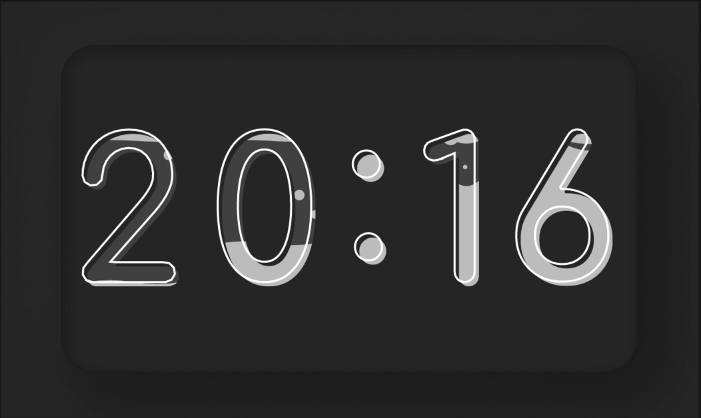
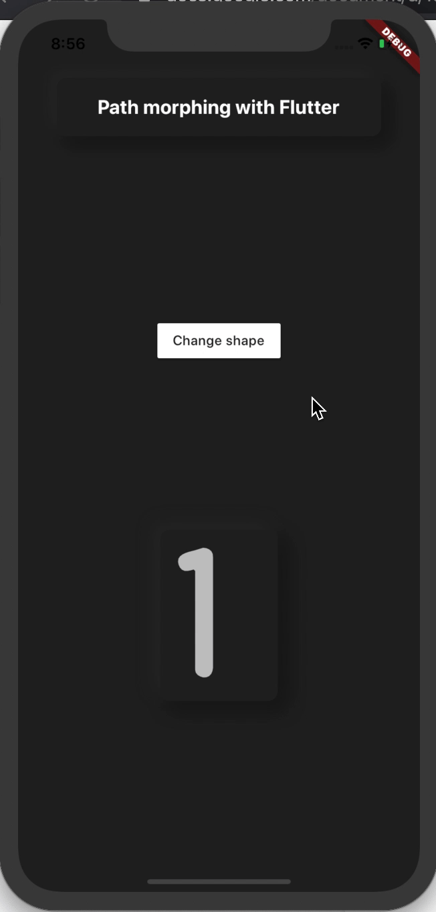

# Path morphing with flutter

PATH MORPHING, FROM FIGMA TO FLUTTER APP

## Context

I participated to the Flutter clock challenge with a coworker. The goal was to build a clock with Flutter for an iot device. Our biggest challenge was to create an animation between digits. We wanted each digit to transform their shapes.

## The project

The goals of this app is to create an animation between two digits.

This type of shape animation is called path morphing.

[Related article](https://blog.bam.tech/developer-news/path-morphing-from-figma-to-flutter-app)